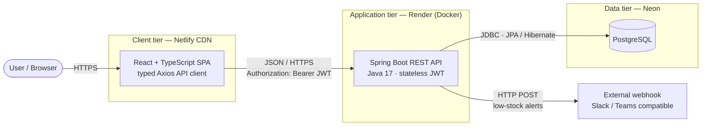
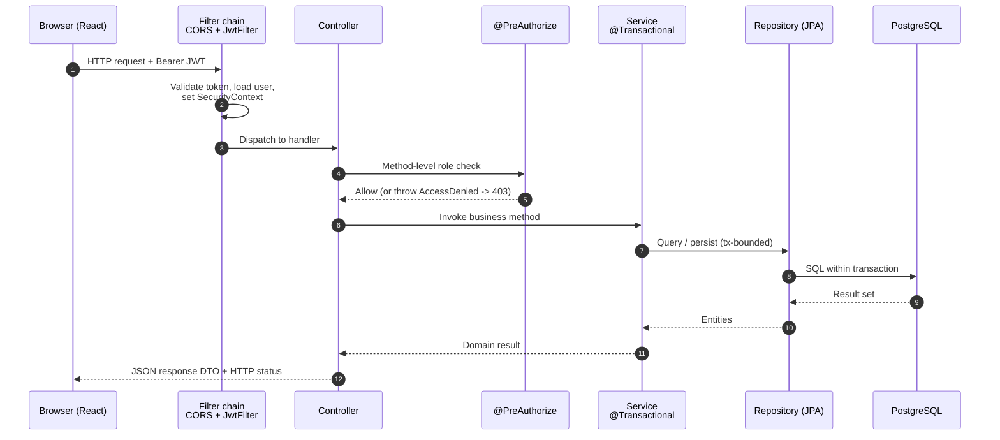
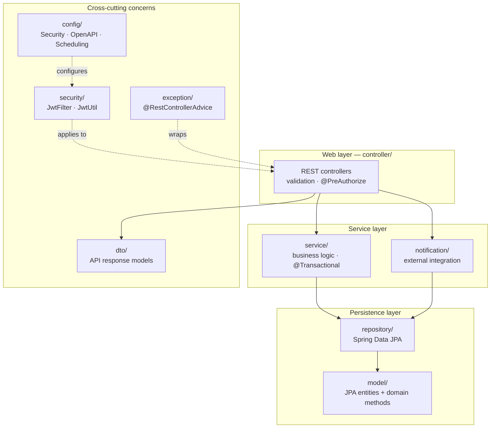
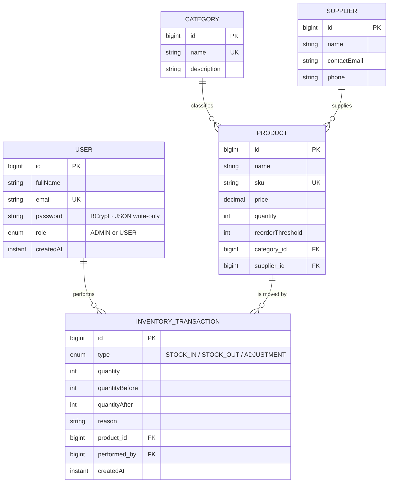
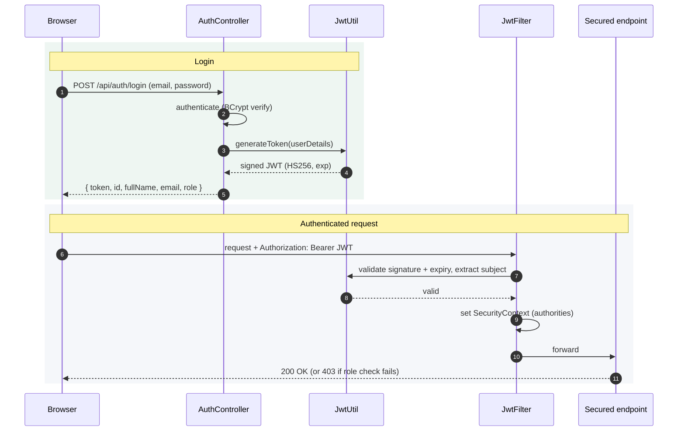
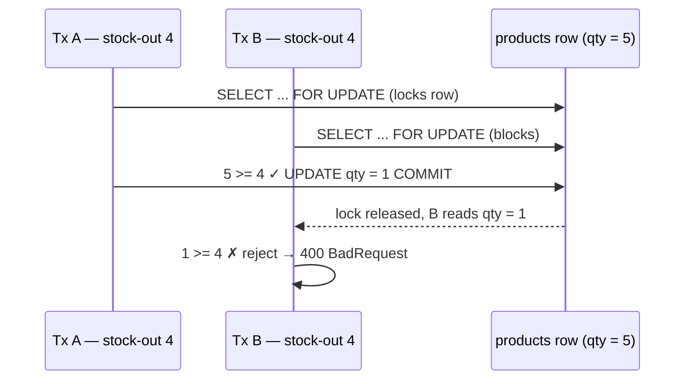
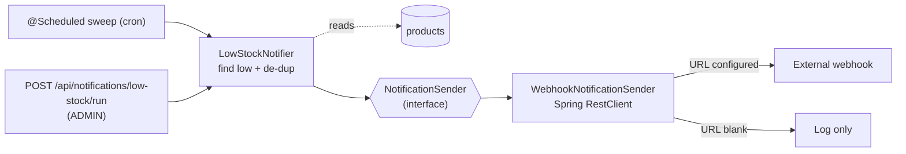
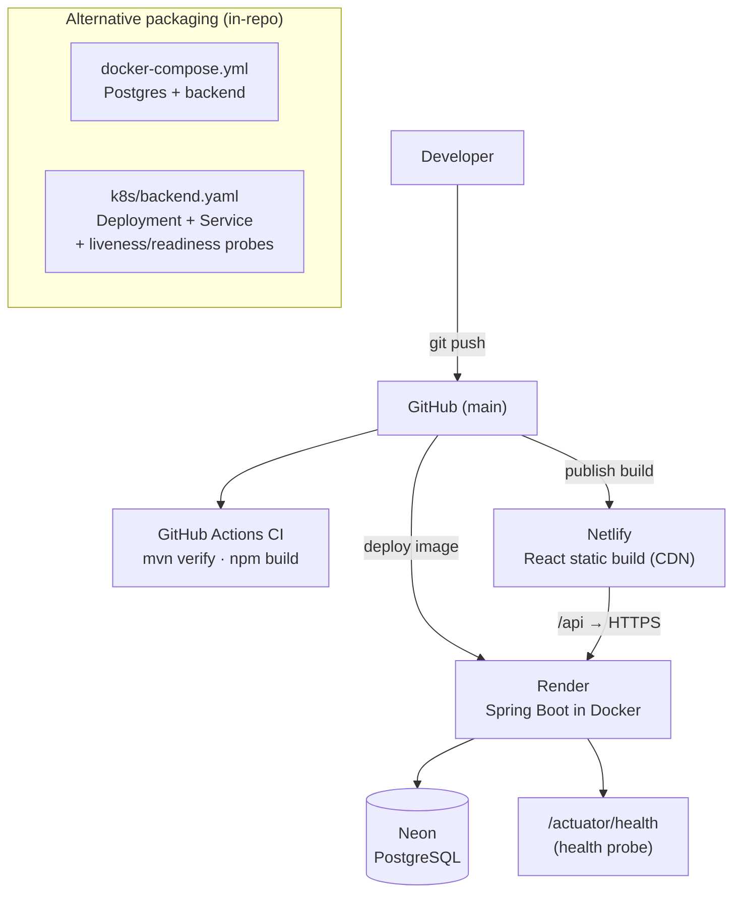

<div >

# StockBase — Full Stack Inventory Management System
</div>


---

## Live Application

Frontend:

```text
https://fanciful-narwhal-46443d.netlify.app/
```

Backend API:

```text
https://stockbase-rpe7.onrender.com
```

Note: The backend is deployed on Render free tier. If inactive, the first request may take 30 to 60 seconds while the service wakes up.

---

## Overview

StockBase is a production-grade full-stack inventory management system built with **React**, **Spring Boot**, and **PostgreSQL**.

The application supports secure user authentication, role-based access control, inventory tracking, product management, stock transaction auditing, low-stock alerts, supplier and category management, reporting dashboards, and CSV export functionality.

This project demonstrates a complete cloud-deployed full-stack architecture using:

```text
React Frontend       → Netlify
Spring Boot Backend  → Render Docker Deployment
PostgreSQL Database  → Neon Cloud Database
```

---

## Resume Bullet

> Built and deployed a full-stack Inventory Management System using React, Spring Boot, PostgreSQL, Netlify, Render, and Neon, featuring JWT authentication, role-based access control, inventory transaction tracking, low-stock alerts, supplier management, reporting dashboards, CSV export functionality, and RESTful API integration.

---

## Tech Stack

| Layer | Technology |
|---|---|
| Frontend | React 18 + TypeScript, React Router, Recharts, Axios |
| Backend | Spring Boot 3.2, Java 17 |
| Database | PostgreSQL hosted on Neon |
| Authentication | Spring Security, JWT |
| ORM | Spring Data JPA, Hibernate |
| Validation | Jakarta Bean Validation |
| Charts | Recharts |
| CSV Export | Apache Commons CSV |
| Backend Deployment | Render using Docker |
| Frontend Deployment | Netlify |
| Database Deployment | Neon PostgreSQL |

---

## Features

### Authentication & Authorization

- JWT-based login and registration
- Role-based access control
- ADMIN users can create, update, and delete records
- USER accounts can view inventory and record transactions
- Token stored in localStorage
- Axios interceptor attaches JWT token to API requests
- Auto-redirect to login on unauthorized requests
- Spring Security protected backend routes

---

### Product Management

- Full product CRUD operations
- Unique SKU validation
- Product name and SKU search
- Category-based filtering
- Supplier association
- Per-product reorder threshold
- Automatic inventory status calculation

Product status values:

```text
In Stock
Low Stock
Out of Stock
```

---

### Inventory Transactions

- Stock In
- Stock Out
- Manual Adjustment
- Quantity validation
- Prevents over-withdrawing when stock is insufficient
- Records transaction type, user, timestamp, and quantity changes
- Maintains full inventory audit history

---

### Reorder Alerts

- Detects products at or below reorder threshold
- Displays real-time low-stock alerts
- Provides suggested restock quantity
- Supports quick restock workflow

---

### Reports

- Inventory value by category
- Supplier-wise inventory report
- Low-stock report
- Interactive dashboard charts using Recharts
- CSV export for product inventory
- CSV export for low-stock products

---

## Demo Accounts

```text
Admin
Email: admin@stockbase.com
Password: admin123

User
Email: user@stockbase.com
Password: user123
```

---

## Architecture

StockBase is a **layered, stateless full-stack application**. The React/TypeScript
single-page app is a pure client that talks to a Spring Boot REST API over HTTPS,
carrying a JSON Web Token on every request. The API is organized into strict layers
(controller -> service -> repository), persists to PostgreSQL through JPA/Hibernate,
and integrates outward to an external webhook for low-stock alerts. Because
authentication is token-based rather than session-based, the API is horizontally
scalable with no sticky sessions or shared session store.

### 1. System context



### 2. Request lifecycle

Every API call flows through the same pipeline. Security is enforced twice: once at
the URL level in the filter chain, and again at the method level via `@PreAuthorize`.
Controllers return **DTOs**, never JPA entities, so persistence internals never reach
the client.



### 3. Backend layered design

Dependencies point strictly downward (web -> service -> persistence). Cross-cutting
concerns are isolated in their own packages and applied via Spring (filters, AOP,
advice) rather than being tangled into business code.



### 4. Domain model

The product quantity is effectively a projection of the transaction ledger: every
stock movement writes an immutable `InventoryTransaction` capturing who did what,
when, and the before/after quantities.



### 5. Authentication & authorization

Stateless JWT. A login mints a signed token; every subsequent request is
authenticated by a `OncePerRequestFilter` that validates the token and populates the
`SecurityContext`, which method-level `@PreAuthorize` rules then read.



**Authorization matrix**

| Endpoint group | Anonymous | USER | ADMIN |
|---|:---:|:---:|:---:|
| `POST /api/auth/**`, `/actuator/health`, `/swagger-ui/**` | ✅ | ✅ | ✅ |
| `GET /api/**` (reads) | ❌ | ✅ | ✅ |
| `POST/PUT/DELETE /api/**` (writes) | ❌ | ❌ | ✅ |

### 6. Concurrency control

Recording a stock movement is a read-check-write sequence, which is a classic race.
The service fetches the product under a **pessimistic write lock**
(`SELECT ... FOR UPDATE` via `@Lock(PESSIMISTIC_WRITE)`), so concurrent movements on
the same product are serialized and stock can never be oversold below zero.



### 7. Low-stock external integration

Decoupled from the write path: a scheduled sweep (and an on-demand admin endpoint)
find newly-low products, de-duplicate them, and push alerts through a
`NotificationSender` interface. A missing webhook URL degrades gracefully to logging,
and any send failure is contained so it can never break a stock operation.



### 8. Deployment topology



### Component responsibilities

| Package | Responsibility | Representative types |
|---|---|---|
| `controller/` | HTTP endpoints, request validation, method-level authorization, DTO mapping | `ProductController`, `TransactionController`, `NotificationController` |
| `service/` | Business rules, transaction boundaries, orchestration | `TransactionService`, `ProductService`, `ReportService` |
| `repository/` | Data access via Spring Data JPA, incl. the pessimistic-lock fetch | `ProductRepository`, `TransactionRepository` |
| `model/` | JPA entities + small domain methods (`isLowStock()`) | `Product`, `InventoryTransaction`, `User` |
| `dto/` | Response models that decouple the API from entities | `TransactionResponse` |
| `security/` | Stateless JWT auth: filter, token utility, user details | `JwtFilter`, `JwtUtil`, `StockbaseUserDetailsService` |
| `exception/` | Central error handling → consistent JSON, correct status codes | `GlobalExceptionHandler` |
| `notification/` | External integration (find low stock → webhook) | `LowStockNotifier`, `NotificationSender`, `WebhookNotificationSender` |
| `config/` | Security chain, OpenAPI/Swagger, scheduling | `SecurityConfig`, `OpenApiConfig`, `SchedulingConfig` |

### Key architectural decisions

| Decision | Choice | Rationale |
|---|---|---|
| Authentication | Stateless JWT (no server session) | Horizontal scalability; no sticky sessions or shared session store |
| Concurrency | Pessimistic row lock (`SELECT ... FOR UPDATE`) | Guarantees no oversell with **no schema migration** on already-deployed data; chosen over optimistic `@Version` |
| API contract | DTOs separate from JPA entities | Prevents leaking entity internals (e.g. password hash) and decouples wire format from schema |
| Error handling | Central `@RestControllerAdvice` | Consistent JSON errors, correct status codes (e.g. 403 vs 500), no internal detail leakage |
| Front end | React + TypeScript (SPA) | Type-safe end-to-end contract; a Next.js/SSR rewrite adds no value for an authenticated dashboard |
| Integration | Interface + decoupled sweep | Unit-testable seam; notification failures never block core writes |
| Rendering of low stock | Domain method on the entity | Single source of truth reused by dashboard, reports, and alerts |
| Schema management | Hibernate auto-DDL (`update`) | Sufficient for this scope; Flyway migrations noted as the production next step |

---

## REST API Reference

### Authentication

| Method | Endpoint | Access |
|---|---|---|
| POST | `/api/auth/register` | Public |
| POST | `/api/auth/login` | Public |
| GET | `/api/auth/me` | Authenticated |

---

### Products

| Method | Endpoint | Access |
|---|---|---|
| GET | `/api/products` | All authenticated users |
| GET | `/api/products/{id}` | All authenticated users |
| GET | `/api/products/low-stock` | All authenticated users |
| GET | `/api/products/search?q=` | All authenticated users |
| POST | `/api/products` | Admin |
| PUT | `/api/products/{id}` | Admin |
| DELETE | `/api/products/{id}` | Admin |

---

### Transactions

| Method | Endpoint | Access |
|---|---|---|
| GET | `/api/transactions` | All authenticated users |
| GET | `/api/transactions/recent?limit=20` | All authenticated users |
| GET | `/api/transactions/product/{id}` | All authenticated users |
| POST | `/api/transactions` | All authenticated users |

---

### Reports

| Method | Endpoint | Access |
|---|---|---|
| GET | `/api/reports/dashboard` | All authenticated users |
| GET | `/api/reports/inventory-by-category` | All authenticated users |
| GET | `/api/reports/inventory-by-supplier` | All authenticated users |
| GET | `/api/reports/low-stock` | All authenticated users |
| GET | `/api/reports/export/products.csv` | All authenticated users |
| GET | `/api/reports/export/low-stock.csv` | All authenticated users |

---

## Testing & Continuous Integration

The backend ships with an automated test suite covering the core business logic and security rules, run on every push and pull request via GitHub Actions (`.github/workflows/ci.yml`).

| Test | Type | What it proves |
|---|---|---|
| `TransactionServiceTest` | Unit (Mockito) | Stock-in/out/adjustment quantity math, insufficient-stock rejection, and the audit record (before/after quantities, performing user) |
| `ProductServiceTest` | Unit (Mockito) | SKU uniqueness, SKU normalisation, and not-found handling for products and referenced entities |
| `ReportServiceTest` | Unit (Mockito) | Dashboard aggregation (inventory value, stock-level counts) and CSV export shape |
| `ProductTest` | Unit | Stock-status boundaries that drive reorder alerts |
| `SerializationSecurityTest` | Unit | No password (hash) leaks in serialized `User` or `TransactionResponse` JSON |
| `ProductSecurityIntegrationTest` | Integration (`@SpringBootTest` + H2) | Real filter chain + `@PreAuthorize`: reads open to any authenticated user, writes admin-only (403 for non-admin), anonymous refused, health endpoint public |
| `StockTransactionIntegrationTest` | Integration (`@SpringBootTest` + H2) | The locked stock-movement path persists valid changes and rejects over-withdrawal, keeping stock ≥ 0 |
| `StockbaseApplicationTests` | Integration | The full application context starts cleanly |

Integration tests run against an in-memory H2 database (PostgreSQL compatibility mode), so no external database is needed.

Run the suite locally:

```bash
cd backend
mvn test
```

---

## Robustness & Production Concerns

- **No sensitive data over the wire.** Stock transactions are returned through a dedicated `TransactionResponse` DTO instead of the raw JPA entity, so the eagerly-loaded acting user's password hash can never be serialized to a client. The `User.password` field is additionally marked write-only as defense in depth.
- **Concurrency-safe stock movements.** `record()` fetches the product under a pessimistic row-level write lock (`SELECT … FOR UPDATE`), so two simultaneous stock-outs on the same product are serialized and can't both pass the availability check and oversell below zero.
- **Interactive API docs.** OpenAPI 3 with Swagger UI at `/swagger-ui.html`, including a Bearer-JWT "Authorize" flow so endpoints can be exercised from the browser.
- **Health & metrics.** Spring Boot Actuator exposes a public `/actuator/health` (used by the Render health check) and `/actuator/info`.
- **Pagination & sorting.** `GET /api/products/page?page=0&size=20&sort=name` for large catalogs, alongside the existing full-list endpoint.
- **External integration.** A `LowStockNotifier` bridges the inventory database to an external system: on a schedule (and on demand via `POST /api/notifications/low-stock/run`), it detects products newly at/below their reorder threshold and pushes an alert to a configurable Slack/Teams-compatible webhook. The transport sits behind a `NotificationSender` interface (unit-tested with a fake sender), and de-duplicates so a product isn't re-alerted until it recovers and drops again. Set `NOTIFICATIONS_WEBHOOK_URL` to enable; unset = logs only.
- **Typed frontend.** The React app is written in **TypeScript** — typed domain models, a typed Axios API layer, typed context, and typed component props throughout.

---

## API Documentation & Health

| Path | Purpose | Access |
|---|---|---|
| `/swagger-ui.html` | Interactive OpenAPI docs | Public |
| `/v3/api-docs` | OpenAPI JSON spec | Public |
| `/actuator/health` | Liveness/health probe | Public |
| `/actuator/info` | Build/app info | Public |

---

## Run It Locally (zero database setup)

The fastest way to try the app — no PostgreSQL install required. The `local` profile
runs on an in-memory H2 database and auto-seeds demo data.

```bash
# Backend (terminal 1) — http://localhost:8080
cd backend
mvn spring-boot:run -Dspring-boot.run.profiles=local

# Frontend (terminal 2) — http://localhost:3000
cd frontend
npm install
npm start
```

Log in as `admin@stockbase.com / admin123` (admin) or `user@stockbase.com / user123` (read-only).
Swagger UI: `http://localhost:8080/swagger-ui.html` · Health: `http://localhost:8080/actuator/health`.

> On a JDK newer than 21, prefix the backend command with `JAVA_HOME=$(/usr/libexec/java_home -v 21)`
> (macOS) so Lombok's annotation processor runs against a supported JDK.

### Run with Docker Compose (PostgreSQL + backend)

```bash
docker compose up --build
```

Starts PostgreSQL and the backend (prod profile) together; backend on :8080.

### Kubernetes / EKS

Deployment and Service manifests live in `k8s/` — two replicas, resource requests/limits,
and liveness/readiness probes wired to `/actuator/health`. Apply with `kubectl apply -f k8s/`
after pushing an image and populating the `stockbase-secrets` Secret.

---

## Quick Start

### Prerequisites

- Java 17 or higher
- Node.js 18 or higher
- PostgreSQL 14 or higher
- Maven

---

### 1. Clone Repository

```bash
git clone https://github.com/YOUR_USERNAME/stockbase.git
cd stockbase
```

---

### 2. Database Setup

Create a local PostgreSQL database:

```sql
CREATE DATABASE stockbase;
```

---

### 3. Backend Setup

```bash
cd backend
mvn clean package -DskipTests
mvn spring-boot:run
```

Backend runs on:

```text
http://localhost:8080
```

---

### 4. Frontend Setup

```bash
cd frontend
npm install
npm start
```

Frontend runs on:

```text
http://localhost:3000
```

---

## Environment Variables

For production deployment, configure the following variables in Render:

```env
DATABASE_URL=your_jdbc_postgresql_url
DATABASE_USERNAME=your_database_username
DATABASE_PASSWORD=your_database_password
JWT_SECRET=your_secure_jwt_secret
SPRING_PROFILES_ACTIVE=prod
CORS_ORIGINS=https://your-netlify-app.netlify.app
```

Important: Never commit real database credentials, passwords, or JWT secrets to GitHub.

---

## Docker Deployment

The backend is deployed on Render using Docker.

Example Dockerfile:

```dockerfile
FROM maven:3.9-eclipse-temurin-17 AS build
WORKDIR /app
COPY backend/pom.xml .
COPY backend/src ./src
RUN mvn clean package -DskipTests

FROM eclipse-temurin:17-jre
WORKDIR /app
COPY --from=build /app/target/stockbase-api-1.0.0.jar app.jar
EXPOSE 8080
ENTRYPOINT ["java", "-jar", "app.jar"]
```

---

## Frontend Production API Configuration

The frontend communicates with the deployed backend through Axios.

Example:

```js
const api = axios.create({
  baseURL: 'https://stockbase-rpe7.onrender.com'
});
```

---

## Deployment Summary

| Component | Platform | Status |
|---|---|---|
| Frontend | Netlify | Deployed |
| Backend | Render | Deployed |
| Database | Neon PostgreSQL | Deployed |
| Authentication | JWT + Spring Security | Working |
| Seed Data | DataSeeder | Loaded |
| Reports | Recharts + REST API | Working |

---

## Project Structure

```text
stockbase/
├── Dockerfile
├── render.yaml
├── LICENSE
├── .gitignore
├── .github/
│   └── workflows/
│       └── ci.yml
├── backend/
│   ├── pom.xml
│   └── src/
│       ├── main/java/com/stockbase/
│       │   ├── StockbaseApplication.java
│       │   ├── config/
│       │   │   ├── SecurityConfig.java
│       │   │   ├── OpenApiConfig.java
│       │   │   └── DataSeeder.java
│       │   ├── controller/
│       │   ├── service/
│       │   ├── repository/
│       │   ├── model/
│       │   ├── dto/
│       │   │   └── TransactionResponse.java
│       │   ├── security/
│       │   └── exception/
│       └── test/java/com/stockbase/
│           ├── StockbaseApplicationTests.java
│           ├── model/ProductTest.java
│           ├── service/
│           │   ├── TransactionServiceTest.java
│           │   ├── ProductServiceTest.java
│           │   ├── ReportServiceTest.java
│           │   └── StockTransactionIntegrationTest.java
│           └── security/
│               ├── ProductSecurityIntegrationTest.java
│               └── SerializationSecurityTest.java
│
└── frontend/
    ├── package.json
    ├── netlify.toml
    └── src/
        ├── api/
        │   └── index.js
        ├── context/
        │   └── AuthContext.js
        ├── components/
        │   ├── UI.js
        │   ├── Sidebar.js
        │   ├── ProductModal.js
        │   └── TransactionModal.js
        └── pages/
            ├── AuthPage.js
            ├── Dashboard.js
            ├── Products.js
            ├── Transactions.js
            ├── ReorderAlerts.js
            ├── Categories.js
            ├── Suppliers.js
            └── Reports.js
```

---

## Engineering Highlights

- Full-stack production deployment
- Dockerized Spring Boot backend
- Cloud PostgreSQL database integration
- JWT authentication and protected routes
- Role-based access control
- RESTful API architecture
- Inventory transaction auditing
- Real-time low-stock monitoring
- Analytics dashboard with Recharts
- CSV export functionality
- Responsive React frontend
- Cloud-ready environment variable configuration
- Automated unit + integration test suite (JUnit 5, Mockito, Spring Security Test, H2)
- Continuous integration via GitHub Actions
- Response DTOs preventing sensitive-data exposure
- Pessimistic locking for race-free stock updates
- OpenAPI/Swagger interactive documentation
- Actuator health and metrics endpoints
- Paginated and sortable list endpoints

---

## Future Improvements

```text
Docker Compose for local development
Flyway/Liquibase schema migrations (replacing ddl-auto=update in production)
Redis caching for reports
WebSocket-based real-time stock alerts
Barcode scanner support
Multi-warehouse inventory management
AI-based demand forecasting
Advanced sales and purchase order modules
Expanded controller-layer and end-to-end test coverage
```

---

## Author

**Surya Prabhav Gurram**  
Master’s in Computer Science  
University of Oklahoma

Focus areas:

```text
Full-Stack Development
Database Systems
Artificial Intelligence
Cloud Deployment
Backend Engineering
System Architecture
```

---

<div align="center">

<p>
  
</p>

</div>
